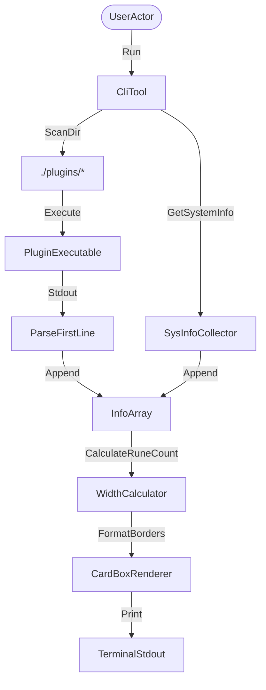

# Architecture and Decisions (ADRs)

This document records the system architecture and key design decisions for `mini-fetch`.

## System Overview

`mini-fetch` is designed as a dual-channel status reporter (a portable POSIX-compatible Shell script and a compiled Go binary). The tool queries system resource endpoints and renders a structured, double-pane terminal card box.

## Key Components

1. **Information Collectors**: Platform-specific metric readers query `/proc` on Linux and `sysctl` / `vm_stat` on macOS.
2. **Dynamic Plugin Loader**: Scans the `./plugins` directory, filters for executables, executes them, and reads the first stdout line.
3. **Card Box Renderer**: Calculates the maximum visible widths of both panels (logo and info) by stripping ANSI color escapes and counting unicode runes, drawing borders symmetrically.

## ADRs

### ADR 0001: Rune-Count Layout Sizing
**Status**: Accepted  
**Date**: 2026-06-11  

#### Context
Using byte-based length calculations (`len()` in Go) for padding caused the box borders to misalign. This was because UTF-8 block-drawing symbols (like `█` and `░`) occupy 3 bytes but only 1 terminal column.

#### Decision
All visible string width calculations now use Go's `utf8.RuneCountInString` and Bash's length operator `${#var}`, stripping ANSI sequences beforehand.

#### Consequences
- **Positive**: Borders remain perfectly aligned regardless of color codes or block graphics.
- **Negative**: Slight overhead of UTF-8 decoding, negligible for small outputs.

### ADR 0002: Modular Plugin Extensibility
**Status**: Accepted  
**Date**: 2026-06-11  

#### Context
Hardcoding extra rows (like Git branch or weather) bloats the core code and makes the tool rigid.

#### Decision
Implement a folder-based plugin scanner that looks for executables in `./plugins` and appends their outputs.

#### Consequences
- **Positive**: Users can write custom checks in any language without modifying the core binary.
- **Negative**: Subprocess execution overhead.

