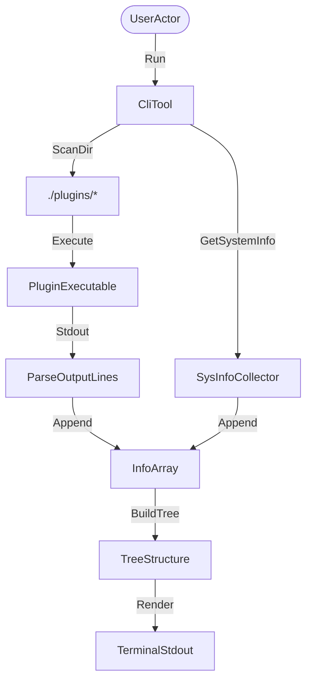

# Architecture and Decisions (ADRs)

This document records the system architecture and key design decisions for `arbol`.

## System Overview

`arbol` is designed as a dynamic, tree-structured terminal status reporter. It is written in Go and queries system resource endpoints, building and rendering a hierarchical tree structure side-by-side with OS logo banners.

## Key Components

1. **Information Collectors**: Platform-specific metric readers query `/proc` on Linux and `sysctl` / `vm_stat` on macOS.
2. **Dynamic Plugin Loader**: Scans the `./plugins` directory, filters for executables, executes them, and structures their multi-line outputs into subtrees.
3. **Tree Renderer**: Resolves parent-child relationships and prints a colorized Git-Graph style tree layout.

## ADRs

### ADR 0001: Rune-Count Layout Sizing
**Status**: Accepted  
**Date**: 2026-06-11  

#### Context
Using byte-based length calculations (`len()` in Go) for padding caused visual misalignments since UTF-8 block-drawing symbols (like `█` and `░`) occupy 3 bytes but only 1 terminal column.

#### Decision
All visible string width calculations use Go's `utf8.RuneCountInString`, stripping ANSI sequences beforehand.

#### Consequences
- **Positive**: Visual alignments remain perfect regardless of color codes or block graphics.
- **Negative**: Negligible UTF-8 decoding overhead.

### ADR 0002: Modular Plugin Extensibility
**Status**: Accepted  
**Date**: 2026-06-11  

#### Context
Hardcoding extra rows (like Git branch or weather) bloats the core code and makes the tool rigid.

#### Decision
Implement a folder-based plugin scanner that looks for executables in `./plugins` and structures their outputs.

#### Consequences
- **Positive**: Users can write custom checks in any language without modifying the core binary.
- **Negative**: Subprocess execution overhead.
